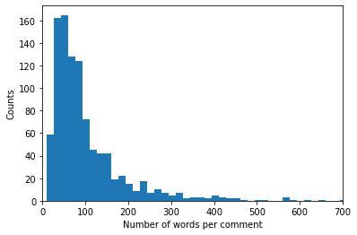
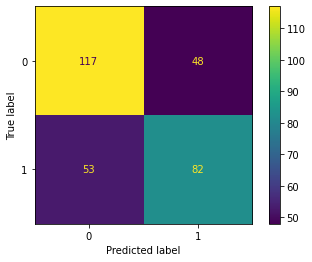
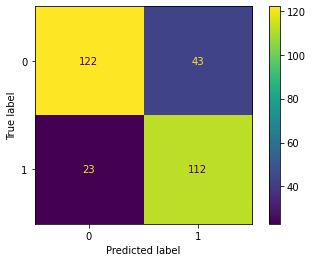
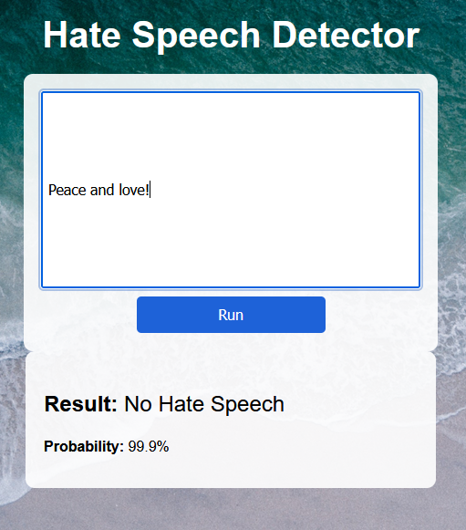

<!-- anchor tag for back-to-top links -->
<a name="readme-top"></a>

<!-- PROJECT LOGO -->
<div align="center">
  <a href="https://github.com/JensBender/hate-speech-detection">
    
  </a>
  <p>
    <br />
    Implemented a hate speech detector for social media comments using advanced deep learning techniques. The fine-tuned BERT model (78% accuracy) outperformed SimpleRNN and LSTM models and was deployed via a web application and an API.
    <br />
  </p>
</div> 

---

## Table of Contents
<ol>
  <li>
    <a href="#about-the-project">About The Project</a>
    <ul>
      <li><a href="#summary">Summary</a></li>
      <li><a href="#built-with">Built With</a></li>
    </ul>
  </li>
  <li>
    <a href="#motivation">Motivation</a>
  </li>
  <li>
    <a href="#data">Data</a>
  </li>
  <li>
    <a href="#model-building">Model Building</a>
  </li>
  <li>
    <a href="#model-performance">Model Performance</a>
  </li>
    <ul>
      <li><a href="#accuracy">Accuracy</a></li>
      <li><a href="#classification-report">Classification Report</a></li>
      <li><a href="#confusion-matrix">Confusion Matrix</a></li>
      <li><a href="#illustrative-examples">Illustrative Examples</a></li>
    </ul>
  <li>
    <a href="#model-deployment">Model Deployment</a>
  </li>
    <ul>
      <li><a href="#web-application">Web Application</a></li>
      <li><a href="#api">API</a></li>
    </ul>
  <li>
    <a href="#getting-started">Getting Started</a>
    <ul>
      <li><a href="#prerequisites-for-model-training">Prerequisites for Model Training</a></li>
      <li><a href="#prerequisites-for-model-deployment">Prerequisites for Model Deployment</a></li>
    </ul>
  </li>
  <li>
    <a href="#appendix">Appendix</a>
    <ul>
      <li><a href="#simplernn-preprocessing-model-architecture-and-hyperparameters">SimpleRNN: Preprocessing, Model Architecture and Hyperparameters</a></li>
    </ul>
    <ul>
      <li><a href="#lstm-preprocessing-model-architecture-and-hyperparameters">LSTM: Preprocessing, Model Architecture and Hyperparameters</a></li>
    </ul>
    <ul>
      <li><a href="#fine-tuned-bert-preprocessing-model-architecture-and-hyperparameters">Fine-Tuned BERT: Preprocessing, Model Architecture and Hyperparameters</a></li>
    </ul>
  </li>
</ol>


<!-- ABOUT THE PROJECT -->
## About The Project

### Summary
+ Motivation: Develop a hate speech detector for social media comments. 
+ Data: Utilized the [ETHOS Hate Speech Detection Dataset](https://github.com/intelligence-csd-auth-gr/Ethos-Hate-Speech-Dataset).
+ Models: The fine-tuned BERT model demonstrated superior performance (78.0% accuracy) compared to the SimpleRNN (66.3%) and LSTM (70.7%) models.
+ Deployment: The fine-tuned BERT model was prepared for production by integrating it into a web application and an API endpoint.

### Built With
* [![TensorFlow][TensorFlow-badge]][TensorFlow-url]
* [![scikit-learn][scikit-learn-badge]][scikit-learn-url]
* [![NumPy][NumPy-badge]][NumPy-url]
* [![Pandas][Pandas-badge]][Pandas-url]
* [![Matplotlib][Matplotlib-badge]][Matplotlib-url]
* [![Flask][Flask-badge]][Flask-url]
* [![Python][Python-badge]][Python-url]
* [![Spyder][Spyder-badge]][Spyder-url]
* ![HTML5][HTML5-badge]
* ![CSS3][CSS3-badge]

<p align="right">(<a href="#readme-top">back to top</a>)</p>


<!-- Motivation -->
## Motivation
+ Problem: Hate speech is on the rise globally, especially on social media platforms (source: [United Nations](https://www.un.org/en/hate-speech/understanding-hate-speech/what-is-hate-speech)).
+ Project goal: Utilize deep learning for hate speech detection in social media comments.
+ Definition of hate speech: Insulting public speech directed at specific individuals or groups on the basis of characteristics such as race, religion, ethnic origin, national origin, sex, disability, sexual orientation, or gender identity ([Mollas, Chrysopoulou, Karlos, & Tsoumakas, 2022](https://link.springer.com/article/10.1007/s40747-021-00608-2)).

<p align="right">(<a href="#readme-top">back to top</a>)</p>


<!-- Data -->
## Data
+ 998 comments from YouTube and Reddit validated using the Figure-Eight crowdsourcing platform.
+ Dataset: [ETHOS Hate Speech Detection Dataset](https://github.com/intelligence-csd-auth-gr/Ethos-Hate-Speech-Dataset).
+ Balanced data: 43.4% hate speech.
+ Comment length: Mean = 112 words (std = 160).



<p align="right">(<a href="#readme-top">back to top</a>)</p>


<!-- Model Building -->
## Model Building
Benchmark models ([Mollas, Chrysopoulou, Karlos, & Tsoumakas, 2022](https://link.springer.com/article/10.1007/s40747-021-00608-2)):
+ Random Forest: 65.0% Accuracy
+ Support Vector Machine: 66.4% Accuracy

Comparison of three deep learning models:
+ SimpleRNN
  + Preprocessing, model architecture and hyperparameters: [See details](#simplernn-preprocessing-model-architecture-and-hyperparameters)
+ LSTM
  + Preprocessing, model architecture and hyperparameters: [See details](#lstm-preprocessing-model-architecture-and-hyperparameters)
+ Fine-tuned BERT
  + Implementation with TensorFlow Hub
  + Small BERT model: [small_bert/bert_en_uncased_L-4_H-512_A-8](https://tfhub.dev/tensorflow/small_bert/bert_en_uncased_L-4_H-512_A-8/2)
  + Preprocessing, model architecture and hyperparameters: [See details](#fine-tuned-bert-preprocessing-model-architecture-and-hyperparameters)

<p align="right">(<a href="#readme-top">back to top</a>)</p>


<!-- Model Performance -->
## Model Performance
### Accuracy
|                   | SimpleRNN | LSTM     | Fine-Tuned BERT |
|-------------------|-----------|----------|-----------------|
| Training Accuracy | 91.8%     | 100%     | 99.9%           |
| Test Accuracy     | 66.3%     | 70.7%    | 78.0%           |

<p align="right">(<a href="#readme-top">back to top</a>)</p>

### Classification Report
The following classification reports present the performance metrics of the trained models on the test data.

**SimpleRNN**
|                 | Precision | Recall | F1 Score |
|-----------------|-----------|--------|----------|
| No Hate Speech  | 0.69      | 0.71   | 0.70     |
| Hate Speech     | 0.63      | 0.61   | 0.62     |
| Accuracy        |           |        | 0.66     |

**LSTM**
|                 | Precision | Recall | F1 Score |
|-----------------|-----------|--------|----------|
| No Hate Speech  | 0.73      | 0.75   | 0.74     |
| Hate Speech     | 0.68      | 0.66   | 0.67     |
| Accuracy        |           |        | 0.71     |

**Fine-Tuned BERT**
|                 | Precision | Recall | F1 Score |
|-----------------|-----------|--------|----------|
| No Hate Speech  | 0.84      | 0.74   | 0.79     |
| Hate Speech     | 0.72      | 0.83   | 0.77     |
| Accuracy        |           |        | 0.78     |

<p align="right">(<a href="#readme-top">back to top</a>)</p>

### Confusion Matrix
Confusion matrices of the three models based on the test data.
| SimpleRNN              | LSTM              | Fine-Tuned BERT              |
|-----------------------|-----------------------|-----------------------|
|  |  |  |

<p align="right">(<a href="#readme-top">back to top</a>)</p>

### Illustrative Examples
Here are some example comments from the test data along with their true label and model predictions.

|          | True Label | SimpleRNN | LSTM    | Fine-Tuned BERT |
|----------|----------|----------|----------|----------|
|  Women deserve to be abused, I guess. | Hate | Hate | Hate | Hate |
| Christians are all demonic. | Hate | No Hate | Hate | Hate |
| Muslims want war! So take it to them first | Hate | Hate | No Hate | Hate |
| Fat lesbians | Hate | Hate | Hate | Hate |
| What imaginary gender are you? | Hate | No Hate | No Hate | Hate |

<p align="right">(<a href="#readme-top">back to top</a>)</p>


<!-- MODEL DEPLOYMENT -->
## Model Deployment
I deployed the fine-tuned BERT model through both a web application and an API.

### Web Application
Utilizing the Flask framework, HTML, and CSS, I created a web application with a user-friendly interface for users to input text and receive predictions on whether it contains hate speech.

 

### API
I developed an API endpoint to enable integration with other applications or services by leveraging the Flask framework and utilized <a href="https://www.postman.com/">Postman</a> for testing and documenting the API.

API documentation: [See here](https://documenter.getpostman.com/view/28394113/2s946eBERv)


<p align="right">(<a href="#readme-top">back to top</a>)</p>


<!-- GETTING STARTED -->
## Getting Started

### Prerequisites for Model Training
This is a list of the Python packages you need.  
<ul>
  <li>TensorFlow</li>
  <li>TensorFlow Hub</li>
  <li>TensorFlow Text</li>
  <li>Scikit-Learn</li>
  <li>NumPy</li>
  <li>Pandas</li>
  <li>Matplotlib</li>
</ul>

### Prerequisites for Model Deployment
This is a list of the Python packages you need. 
<ul>
  <li>TensorFlow</li>
  <li>TensorFlow Text</li>
  <li>NumPy</li>
  <li>Flask</li>
  <li>Flask-WTF</li>
  <li>WTForms</li>
  <li>Python-dotenv</li>
</ul>

To enhance security, create a `.env` file and create a secret key for the Flask application. Store the secret key in the `.env` file and utilize the `python-dotenv` library to retrieve it. 
  ```
  SECRET_KEY = "Your_secret_key_here"
  ```

<p align="right">(<a href="#readme-top">back to top</a>)</p>


<!-- APPENDIX -->
## Appendix
### SimpleRNN: Preprocessing, Model Architecture and Hyperparameters

**Preprocessing**   
Tokenizer vocabulary size: 5000  
Padded sequence length: 15  
Embedding dimension: 50

**Model Architecture**
| Layer (type) | Output Shape    | Param # | Activation |
| ------------ | --------------- | ------- | ---------- |
| Embedding    | (None, 15, 50)  | 250050  |            |
| SimpleRNN    | (None, 15, 128) | 22912   | tanh       |
| SimpleRNN    | (None, 128)     | 32896   | tanh       |
| Dense        | (None, 64)      | 8256    | relu       |
| Dense        | (None, 1)       | 65      | sigmoid    |

Total params: 314,179  
Trainable params: 314,179  
Non-trainable params: 0

**Hyperparameters**  
Optimizer: Adam  
Learning rate: 0.001  
Loss: Binary Crossentropy  
Epochs: 100  
Batch size: 8  
Dropout rate: 50%  
Early stopping metric: Accuracy

<p align="right">(<a href="#readme-top">back to top</a>)</p>

### LSTM: Preprocessing, Model Architecture and Hyperparameters


**Preprocessing**   
Tokenizer vocabulary size: 5000  
Padded sequence length: 150  
Embedding dimension: 50

**Model Architecture**
| Layer (type) | Output Shape     | Param # | Activation |
| ------------ | ---------------- | ------- | ---------- |
| Embedding    | (None, 150, 50)  | 250050  |            |
| LSTM         | (None, 150, 128) | 91648   | tanh       |
| LSTM         | (None, 128)      | 131584  | tanh       |
| Dense        | (None, 64)       | 8256    | relu       |
| Dense        | (None, 1)        | 65      | sigmoid    |

Total params: 481,603  
Trainable params: 481,603  
Non-trainable params: 0 

**Hyperparameters**  
Optimizer: Adam  
Learning rate: 0.001  
Loss: Binary Crossentropy  
Epochs: 100  
Batch size: 32  
Dropout rate: 50%  
Early stopping metric: Accuracy

<p align="right">(<a href="#readme-top">back to top</a>)</p>

### Fine-Tuned BERT: Preprocessing, Model Architecture and Hyperparameters

**Preprocessing**   
Text preprocessing for BERT models: https://tfhub.dev/tensorflow/bert_en_uncased_preprocess/3

**Model Architecture**
| Layer (type)  | Output Shape     | Param #  | Activation |
| ------------- | ---------------- | -------- | ---------- |
| Text Input    | [(None,)]        | 0        |            |
| Preprocessing | input_type_ids: (None, 128)<br> input_mask: (None, 128)<br> input_word_ids: (None, 128) | 0        |            |
| BERT          | (None, 512)      | 28763649 |            |
| Dropout       | (None, 512)      | 0        |            |
| Dense         | (None, 128)      | 65664    | relu       |
| Dense         | (None, 1)        | 129      | sigmoid    |

Total params: 28,829,442  
Trainable params: 28,829,441  
Non-trainable params: 1 

**Hyperparameters**  
Optimizer: Adam  
Learning rate: 0.0001  
Loss: Binary Crossentropy  
Epochs: 100  
Batch size: 8  
Dropout rate: 50%  
Early stopping metric: Accuracy

<p align="right">(<a href="#readme-top">back to top</a>)</p>

<!-- MARKDOWN LINKS -->
[TensorFlow-badge]: https://img.shields.io/badge/TensorFlow-%23FF6F00.svg?style=for-the-badge&logo=TensorFlow&logoColor=white
[TensorFlow-url]: https://www.tensorflow.org/
[scikit-learn-badge]: https://img.shields.io/badge/scikit--learn-%23F7931E.svg?style=for-the-badge&logo=scikit-learn&logoColor=white
[scikit-learn-url]: https://scikit-learn.org/stable/
[NumPy-badge]: https://img.shields.io/badge/numpy-%23013243.svg?style=for-the-badge&logo=numpy&logoColor=white
[NumPy-url]: https://numpy.org/
[Pandas-badge]: https://img.shields.io/badge/pandas-%23150458.svg?style=for-the-badge&logo=pandas&logoColor=white
[Pandas-url]: https://pandas.pydata.org/
[Matplotlib-badge]: https://img.shields.io/badge/Matplotlib-%23ffffff.svg?style=for-the-badge&logo=Matplotlib&logoColor=black
[Matplotlib-url]: https://matplotlib.org/
[Flask-badge]: https://img.shields.io/badge/flask-%23000.svg?style=for-the-badge&logo=flask&logoColor=white
[Flask-url]: https://flask.palletsprojects.com/en/2.3.x/
[Python-badge]: https://img.shields.io/badge/python-3670A0?style=for-the-badge&logo=python&logoColor=ffdd54
[Python-url]: https://www.python.org/
[Spyder-badge]: https://img.shields.io/badge/Spyder-838485?style=for-the-badge&logo=spyder%20ide&logoColor=maroon
[Spyder-url]: https://www.spyder-ide.org/
[HTML5-badge]: https://img.shields.io/badge/html5-%23E34F26.svg?style=for-the-badge&logo=html5&logoColor=white
[CSS3-badge]: https://img.shields.io/badge/css3-%231572B6.svg?style=for-the-badge&logo=css3&logoColor=white
